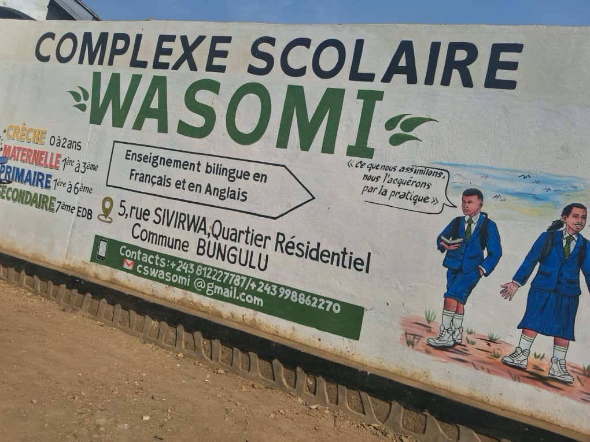

# WASOMI — Site vitrine scolaire

Site vitrine moderne pour le **Complexe Scolaire WASOMI**. Il présente l’école, ses projets, ses partenaires, sa galerie et les informations de contact, avec une identité visuelle axée sur l’innovation et l’excellence éducative.

## Aperçu




## À propos du projet

Ce projet est une application React (Vite) qui met en avant l’école et sa mission. Le site est constitué de sections claires :

- **Héros** : message d’accueil, promesse éducative et call-to-action.
- **À propos** : mission, vision, philosophie et valeurs de l’établissement.
- **Projets** : initiatives en cours, terminées ou à venir.
- **Partenaires** : organisations et réseaux éducatifs associés.
- **Pourquoi WASOMI** : points forts pédagogiques, sécurité, technologie, sport, transport.
- **Galerie** : photos et moments clés de la vie scolaire.
- **Contact** : coordonnées, réseaux sociaux et formulaire.

## Stack

- **React 18** + **TypeScript**
- **Vite**
- **Tailwind CSS 4** + **DaisyUI**
- **Framer Motion** (animations)
- **Lucide React** (icônes)

## Démarrage rapide

```bash
npm install
npm run dev
```

## Scripts

```bash
npm run dev      # Lancer le serveur de développement
npm run build    # Build de production
npm run preview  # Prévisualiser le build
```

## Structure

- `src/App.tsx` : composition des sections
- `src/sections/` : contenu principal (Hero, About, Projects, Partners, Motivation, Galerie, Contact)
- `src/components/` : composants transverses (Navbar)
- `src/index.css` : styles globaux et variables CSS
- `src/assets/` : images et assets

## Personnalisation rapide

- **Couleurs & thème** : modifiables dans `src/index.css` (variables CSS).
- **Images** : modifiables dans `src/assets/` et `src/sections/Galerie.tsx`.
- **Textes** : modifiables dans `src/sections/`.

## Licence

Projet interne — utilisation selon les besoins de l’équipe WASOMI.
